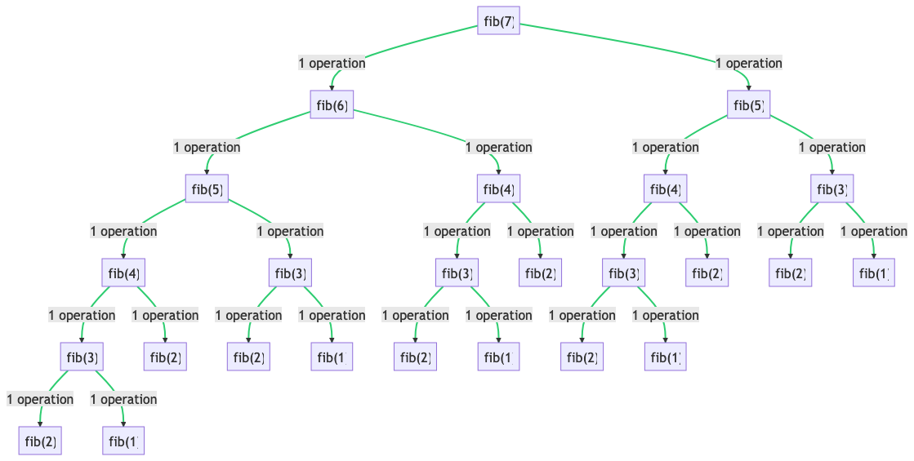

# Parlor Tricks

 Chuck Sailer  
July 5th, 2023

These algorithms might seem like mere parlor tricks, as it's rare for an everyday programmer to require them. However, they serve as an excellent demonstration of Big O notation in action and reinforce best practices for enhancing algorithmic efficiency. Moreover, they act as highly effective assessment tools for interviewers.

## Fibonacci Sequence
The Fibonacci sequence is a series of numbers where each successive number is the sum of the previous two. This sequence has extensive applications in various fields, including nature, art, and mathematics. Nature exhibits Fibonacci numbers in the arrangement of leaves on a stem or petals on a flower. Artists often leverage Fibonacci sequences to create patterns in their works. Mathematicians utilize Fibonacci numbers to explore chaos theory and fractals. Additionally, technical interviewers use Fibonacci to gauge a candidate's ability to write efficient algorithms.

**Problem Statement:** Develop the most efficient method to calculate and return the nth number in a Fibonacci Sequence.

```python
def fib(n):
   """
   Compute the nth number in the Fibonacci Sequence.

   This is a brute force approach to Fibonacci. It will eventually yield the right answer.
   Time Complexity = O(2^n) # Exponential time complexity is highly inefficient.
   Space Complexity = O(n) # Linear space complexity is barely satisfactory at best.

   Note: Space complexity is determined by memory usage, disk space, and call stack. We use the call stack 
   for measuring O(n). The initial call is pushed onto the call stack, as are the subsequent recursive calls.
   When a function finishes execution, it's removed from the call stack.

   For example, if n = 7, the calculation is: fib(7) == 2^7 steps == O(128) time complexity.
   If n = 50, the calculation is: fib(50) == 2^50 steps == O(1,125,899,906,842,624) time complexity. That's over 1 quadrillion!

   The current implementation of fib(n) does provide the correct result, but it's practically unusable unless n is a very small number.
   """
   if n <= 2: return 1
   return fib(n-1) + fib(n-2)
```
Here is a complexity graph for ```fib(7)```  



So, how can we optimize ```fib(n)```? According to the analysis above, the main bottleneck is the time complexity.

Let's recall the problem at hand: returning the nth number in a sequence. One potential solution is to pre-calculate all the numbers in the Fibonacci Sequence and store them in an addressable data structure such as an array or list. This approach ensures a constant time complexity of O(1). However, this solution isn't universally applicable. Imagine we've calculated and stored the first 1000 numbers in the Fibonacci Sequence. While any number within this range can be returned in constant time, what about the 1001st number? That poses a problem. As our task is to return the nth number in the sequence with no specified upper limit, ```fib(n)``` must be able to accommodate any value of n, regardless of its size.

The solution? Dynamic Programming.
## What is Dynamic Programming?
Dynamic programming is a powerful method in computer science and mathematics for solving complex problems by breaking them down into simpler subproblems. It's a strategy of optimization that's used when the optimal solution can be constructed efficiently from optimal solutions to its subproblems.

Dynamic programming involves these two main elements:

1. **Overlapping Subproblems**: This means that the problem can be divided into smaller subproblems which are not independent, meaning the same subproblems are used again and again. The solutions to these overlapping subproblems are typically stored in a table to avoid redundant calculation, which saves computational time.

2. **Optimal Substructure**: A problem is said to have optimal substructure if the optimal solution of the given problem can be obtained by using the optimal solutions of its subproblems. In other words, the overall problem can be solved optimally by solving its subproblems optimally.

Dynamic programming is typically used for optimization problems. Because it stores the solution of subproblems, it avoids recomputation and thus reduces the complexity of the problem. This can result in a substantial reduction in the computation time for problems where the naive recursive approach involves a large amount of repeated computation.

One of the most classic examples of dynamic programming is the calculation of Fibonacci numbers. A naive recursive solution will end up recalculating many subproblems, while a dynamic programming approach will compute each subproblem only once and store its result to be used in other dependent subproblems, thus saving computational time.
